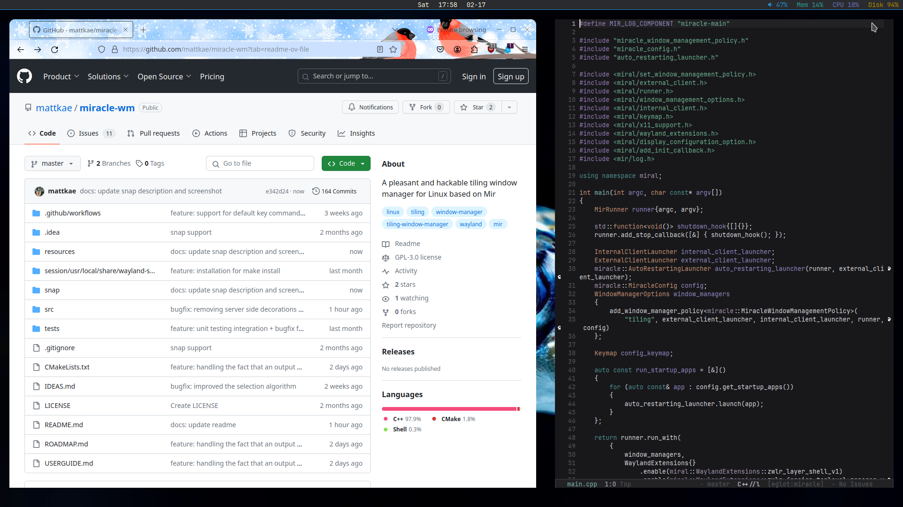

a> [!WARNING]
> This project is a work in progress. The first stable, feature-complete release
> will be version 1.0.0. As such, it is advised that you do not use this as your daily driver
> unless you are willing to encounter some paper cuts along the way. If you are willing to 
> lend your time to find bugs, fix bugs, or submit proposals for new features, it would
> be greatly appreciated.

# About
**miracle-wm** is a Wayland compositor based on [Mir](https://github.com/MirServer/mir). It features a tiling
window manager at its core, very much in the style of [i3](https://i3wm.org/) and [sway](https://github.com/swaywm/sway).
The intention is to build a compositor that is flashier and more feature-rich than either of those compositors, like [swayfx](https://github.com/WillPower3309/swayfx).

# User Guide
For all information related to `miracle-wm`, including installation instructions, build instructions,
and a roadmap, visit: https://mattkae.github.io/miracle-wm-wiki/

