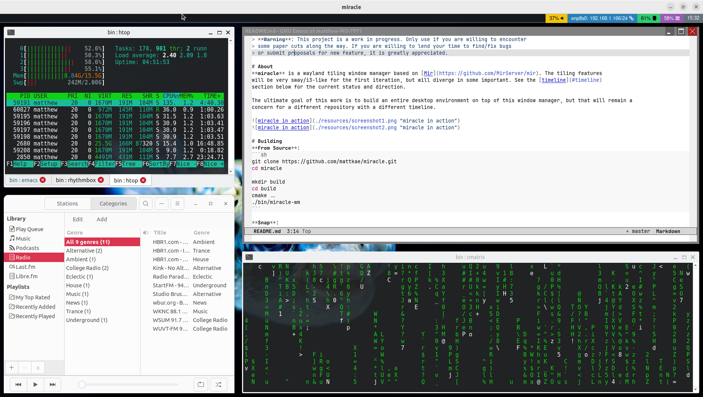

> **Warning**: This project is a work in progress. Only use if you are willing to encounter
> some paper cuts along the way. If you are willing to lend your time to find/fix bugs
> or submit proposals for new features, it is greatly appreciated.

# About
**miracle** is a wayland tiling window manager based on [Mir](https://github.com/MirServer/mir). The tiling features
are very sway/i3-like, but will diverge in some important ways in the future. See the [timeline](#timeline)
section below for the current status and direction.




# Install
```
sudo snap install miracle-wm --edge
```

# Building
**From Source**:
```sh
git clone https://github.com/mattkae/miracle.git
cd miracle

mkdir build
cd build
cmake ..
./bin/miracle-wm
```

**Snap**:
```sh
cd miracle-wm
snapcraft
sudo snap install --dangerous miracle-wm_*.snap
```

# Running

**On login**:

Once installed, you may select the "Miracle WM" option from your display manager before you login (e.g. GDM or LightDM).
In most environments, this presents itself as a little "settings" button after you select your name.

**Hosted**:

To run the window manager as a window in your current desktop session, simply run:
```sh
WAYLAND_DISPLAY=wayland-98 miracle-wm
```

Note that this is only useful if you want to test-drive the window manager or do some development on it for yourself.

# Usage
See the [user guide](USERGUIDE.md) for information on how to use the miracle window manager.

# Timeline
The goal is to have a tiling manager that I am comfortable daily-driving by summer of 2024.

**Proof of Concept (Due: January 15th)** Version: 0.1

Features:
- [x] Layout new window
- [x] Delete window
- [x] Resizing windows
- [x] Changing selected window with keyboard
- [x] Moving window with keyboard
- [x] Gaps in windows
- [x] Account for minimum sizes on windows (e.g. gedit)
- [x] Disabling many of the Floating Window Manager features
- [x] Handle exclusion zones
- [x] Handle output creation
- [x] Handle output updating
- [ ] Handle output deletion
- [x] Handle fullscreen

**Stabilization + Usability (Due: March 1st)** Version: 0.2

Features:
- [ ] Fix major bugs
- [ ] Configuration File
  - [ ] Gap size
  - [ ] Action key
  - [ ] Keybindings
- [ ] Workspaces
  - [ ] Moving windows between workspaces
- [ ] Stacking windows
- [ ] Highlight border around selected window
