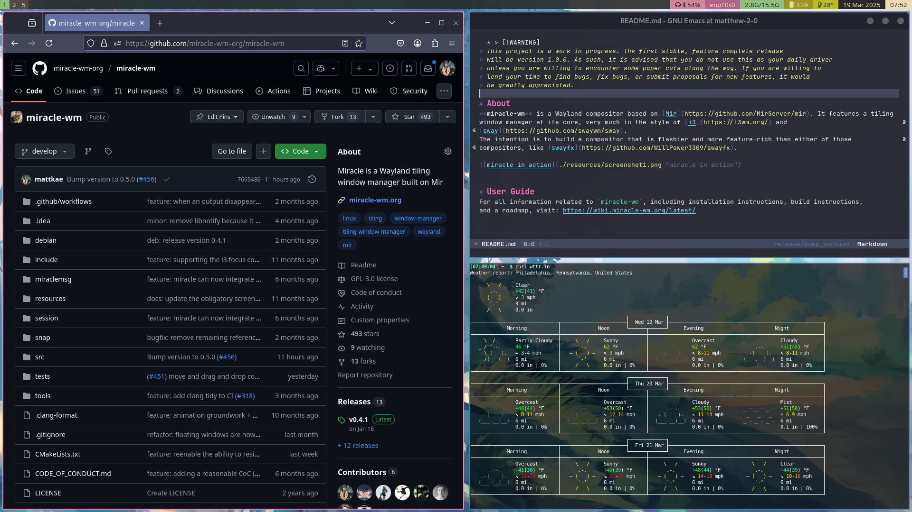

  
  &nbsp;
  
  &nbsp;
  

# miracle-wm

**miracle-wm** is a hackable, stylish, and modern Wayland compositor built on [Mir](https://github.com/MirServer/mir). It brings the keyboard-driven efficiency of i3/Sway to a richer, more extensible experience with smooth animations, a powerful WebAssembly plugin system, and a hot-reloadable configuration.

## Features

- **Tiling/Floating/Custom Window Management**: mix manual tiling, with floating, with entirely custom window management rules
- **Animations**: window open/close, moves, resizes, and workspace transitions all animate out of the box
- **WebAssembly plugin system**: extend and override core behavior without touching a line of C++
- **i3/Sway-compatible IPC**: works with `swaymsg`, Waybar, etc
- **Hot-reload config**: apply config changes instantly
- **Multi-monitor support**: independent workspaces across outputs, fully configurable
- **Accessibility**: magnifier, slow keys, sticky keys, and cursor configuration included

## Getting Started

Installation instructions, build instructions, and a full roadmap live at:

**[wiki.miracle-wm.org](https://wiki.miracle-wm.org/)**

Plugin API documentation is at:

**[docs.miracle-wm.org](https://docs.miracle-wm.org/)**

## Community

Questions, ideas, and contributions are welcome. Find us on Matrix or Discord:

**[#miracle-wm:matrix.org](https://matrix.to/#/#miracle-wm:matrix.org)** · **[Discord](https://discord.gg/4fCadnUGMs)**
